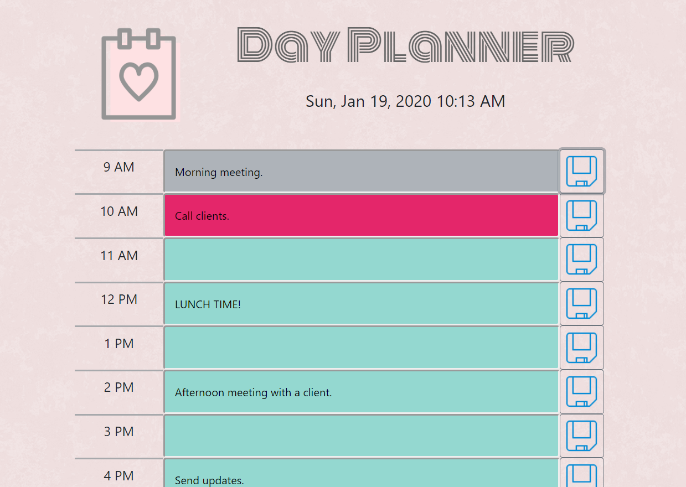

# Day-Planner

### Table of Contents
* General Info
* Files
* Technologies

### General Info
This is a simple calendar application that allows the user to save events for each hour of the day.
The user can enter the plan/schedule in the input field of each timeblock.
The input data (schedule) gets saved in localStorage when the save button next to each timeblock is clicked.
The user needs to update the data by clicking the save button when clear the data also.

### Link
[Click here to use Day Planner](https://emi-dev.github.io/Day-Planner/)

### Files
* index.html
* style.css (under "assets/css")
* dayPlanner.js (under "assets/js")
* README.md

### Technologies
Project is created with:
* JavaScript
* HTML 5
* CSS 3
* Bootstrap 4
